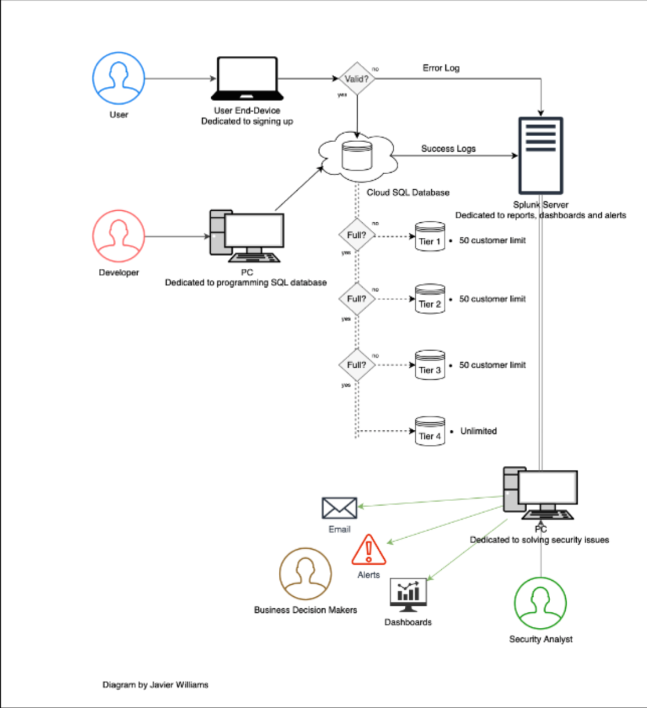

# Koda Tech - SQLite3 Database Security Project

This project focuses on securing the **SQLite3 database** for **Koda Tech**, a fictitious e-commerce company that I made up, and specializes in selling electronic devices. Koda Tech is preparing for the launch of its website and expects a significant customer sign-up rate for promotional discounts. The customer discount system is based on a **4-tier structure**, with the first three tiers offering discounts to up to 50 customers each, and the fourth tier being unlimited but without any discounts.

The goal of this project is to assess and enhance the security of a customer database. As a **Splunk Analyst**, the focus will be on collecting, visualizing, and analyzing database logs to ensure the integrity, security, and performance of the system. This project will identify vulnerabilities such as **SQL injection risks**, **insecure data storage**, and **unauthorized access attempts**. It will also highlight potential operational failures, including **query performance issues**, **data corruption risks**, and **system errors**.

## Project Architecture Diagram

Below is the **logical architecture diagram** for the project, showcasing how customer data flows through the system and is processed by the database and Splunk for analysis.

### Features
- **Four-tier SQLite Database:** Manages customer data and assigns promotional discounts based on tier capacity.
- **Splunk Integration:** Logs customer data transactions and sends them to Splunk for real-time indexing, visualization, and alerting.
- **Security Focus:** Analyzes the database for potential security risks and operational failures.
- **Operational Optimization:** Suggests improvements for database performance, data integrity, and system stability.

## Repository Structure
- **`src/`**: Contains Python scripts for database and Splunk operations.
  - `splunk/`: Configuration and examples for integrating with Splunk.
- **`diagrams/`**: Visual representation of the project architecture.
- **`dashboards/`**: Example configurations for Splunk dashboards.

## Project Objectives
1. **Database Design and Implementation:** Create a four-tier SQLite database to manage customer data and assign discounts based on tiers.
2. **Simulate Data Insertion and Logging:** Automate customer data insertion and log all actions to the database for security analysis.
3. **Splunk Integration:** Forward database logs to Splunk for real-time monitoring, reporting, and visualization.
4. **Security Analysis:** Identify potential vulnerabilities such as SQL injections, insecure data handling, and unauthorized access.
5. **Performance Monitoring:** Identify operational issues, such as query inefficiencies and potential risks of data corruption.
