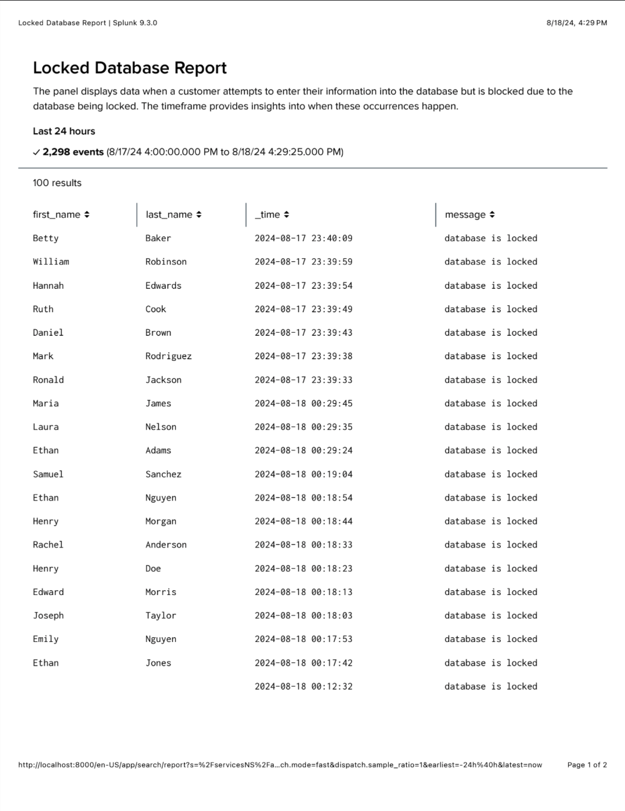
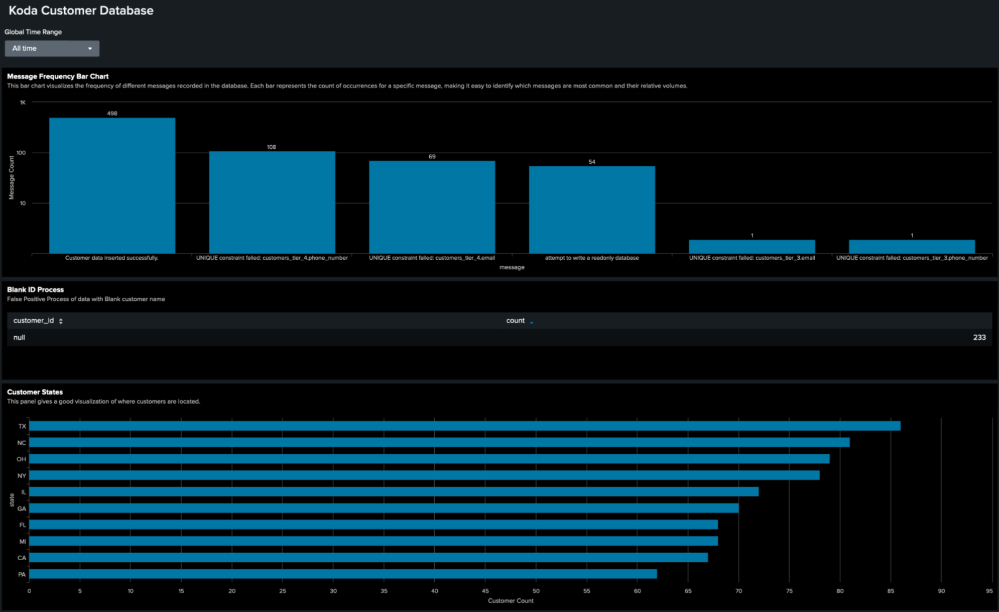
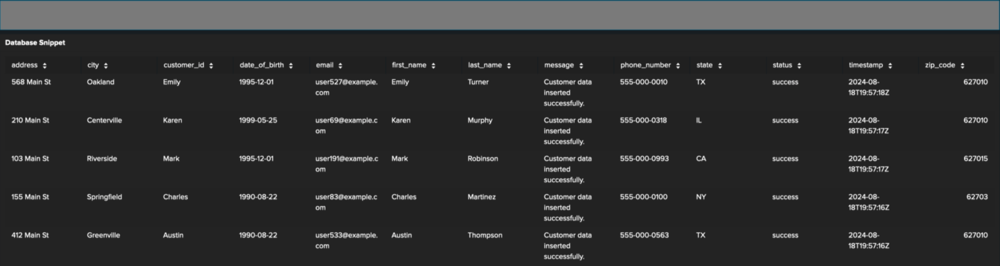

# Dashboards Subdirectory

This folder contains visual outputs and reports for Splunk dashboards, providing insights and monitoring capabilities. Below is the description for each file, with visuals included.

---

## Files

### 1. `report.png`  
**Description**:  
This file contains the *Locked Database Report*, displaying failed customer attempts to access the database due to locks. It includes columns for customer names, timestamps, and failure messages.

**Preview**:  

**Purpose**:  
It helps monitor database locking issues and identify recurring patterns over a given timeframe.

---

### 2. `splunk.png`  
**Description**:  
This file includes a detailed Splunk dashboard that displays:
- **Message Frequency Bar Chart**: Highlights message occurrences (e.g., errors or success logs).  
- **Blank ID Process**: Displays null values for `customer_id` and possible false positives.  
- **Customer States**: A bar chart of customer distributions by state.

**Preview**:  

**Purpose**:  
This dashboard aids in identifying trends, null value issues, and geographic customer patterns.

---

### 3. `splunk_1.png`  
**Description**:  
A continuation or secondary Splunk visual similar to `splunk.png` with more detailed chart breakdowns.

**Preview**:  

**Purpose**:  
Provides additional clarity into specific metrics or logs for troubleshooting and monitoring purposes.

---

## Usage  
These files serve as examples or outputs of a Splunk monitoring project. They can be used to:  
1. Analyze database activity logs.  
2. Identify system issues (e.g., database locks).  
3. Visualize customer data and behavior trends.  

Tip: Ensure you have the Splunk environment configured and data inputs properly ingested.

---

## Next Steps  
To enhance these dashboards:  
- Link real-time alerts for database lock events.  
- Implement data cleaning to reduce null values.  
- Add geographic insights for better state-based analysis.
